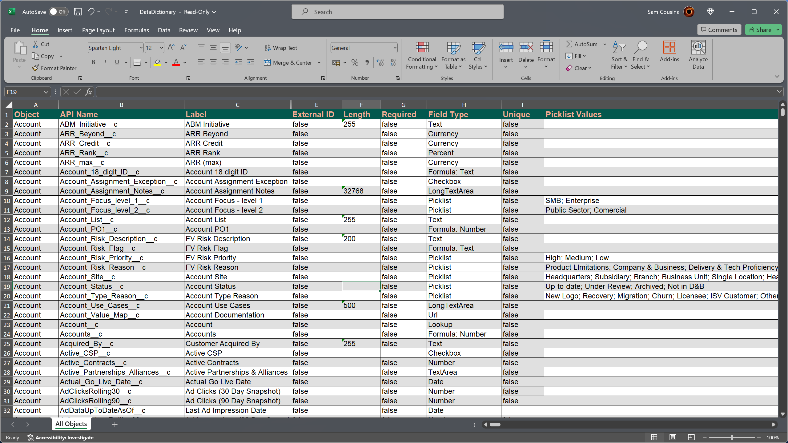

# MetaMapper - Your Salesforce Data Dictionary Designer

Transform your Salesforce Metadata XML into sleek, intuitive Excel data dictionaries with MetaMapper!

This script catapults your data model into the visual realm, making it a breeze to navigate and understand complex Salesforce schemas.

Just drop the script into your force-app directory, hit run, and voilà - a shiny, comprehensive data dictionary for every object, ready for your perusal!

  
## 🧑🏼‍💻 Features

-  **Seamless Conversion:** From XML to XLSX, MetaMapper makes data dictionary creation a snap.🔄

-  **Rich Field Type Support:** Dive into picklists (😲), lookups (🤩), formulas (🤯), and more! 🎨

-  **Auto-Adjusting Layouts**: Enjoy perfectly readable spreadsheets with smart column widths and formatting. 📏

-  **SFDX Friendly**: Designed for the modern Salesforce dev, leaving MDAPI in the dust.🛠
-  **Field Inclusion Options:** Customize your data dictionary to include all fields, only standard fields, or exclusively custom fields. ✅
  

  

## 😕 How do I use it?

MetaMapper is designed to be flexible, so we've made it easy to use in any Salesforce project.

1. Gitlab CI Pipeline

2. Manual Script

### 1. GitLab Pipeline 🚀
MetaMapper is ready to enhance your CI pipeline 🔄, automating the generation of data dictionaries 📚 as you commit and seamlessly post updates to Slack 💬.

To kick things off, simply clone the MetaMapper - Template Repo and dive into these steps:

1.  **New Project** 🆕
2.  **Template - MetaMapper** 📄
3.  **Crate CI variables** ⚙️
    -   **PAT** = -todo-
    -   **SLACK_WEBHOOK_URL** = -todo-
    -   **ARGS** = all, standard, custom

### 2. Drag and Drop
MetaMapper is just a script, so it's really easy to install and run.

1.  **Prepare Python:** Ensure Python 3 or later is installed on your system. 🐍
2.  **Download the Script:** Clone or download the MetaMapper script. 📥
3.  **Install Dependencies:** Run `pip install -r requirements.txt` to install required Python packages. 📦
4.  **Place the Script:** Move the MetaMapper script into your project's `force-app` folder. 📂
5.  **Execute the Script:** Run the script to initiate the data dictionary generation. ▶️
6.  **Review Your Data Dictionary:** Enjoy your newly created Excel-based Salesforce data dictionary. 📊

MetaMapper streamlines the documentation and understanding of Salesforce data models, making it an invaluable tool for developers and administrators aiming to enhance data visibility within their Salesforce environments. 🌈